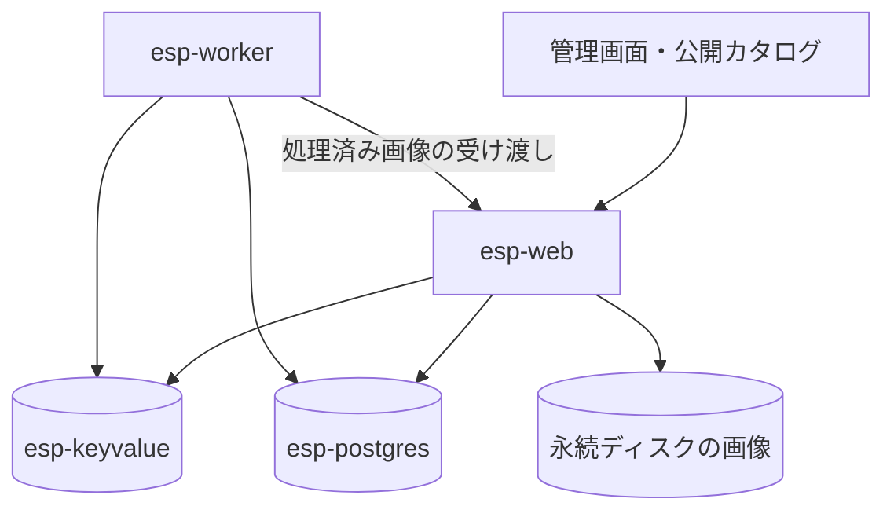

# ESP — 商品運用・バイヤー向けカタログ管理

ESP は、依頼を受けて開発している商品管理用 Web アプリケーションです。国内サイトの商品情報を取り込み、商品・画像・英訳・販売価格を整え、バイヤーに公開カタログを共有し、外部販売サービス向けの CSV を作成します。管理者による生徒アカウントの運用にも対応しています。

稼働先は **Render / [jp-items.com](https://jp-items.com)** です。この README は 2026-09-05 にリポジトリの実装を読み直して更新しました。同日に公開入口と health 応答を確認しています。以下の Render 構成は `render.yaml` が定義する構成であり、今回の調査では Dashboard 上のサービス設定・環境変数・稼働リビジョンとの一致までは確認できていません。

横断的な評価、課題と検証範囲は [リポジトリ分析レポート](docs/REPOSITORY_REVIEW_2026-09-05.md) を参照してください。

## 実装されている機能

| 領域 | 現在の実装 |
| --- | --- |
| 商品取り込み | サイト別の検索・商品 URL 抽出、URL 種別の判定、非同期処理、結果プレビューと選択登録、手動登録、CSV インポート |
| 商品編集 | 日本語・英語の商品名と説明、画像の追加・アップロード・並べ替え、バリエーション、タグ、説明文テンプレート、一覧からの価格・英語名編集 |
| 価格 | ユーザー別の価格ルール、登録時のデフォルトルール適用、商品・バリエーションの販売価格、手動調整と一括更新 |
| 翻訳 | Argos / OpenAI バックエンド、日本語から英語への翻訳提案、登録時の自動適用、レビュー・適用・却下、期限切れ処理の回復 |
| 画像の背景除去 | `rembg` による処理、ジョブ状態の確認、結果プレビュー、個別・一括適用、却下。ルート・画面・ワーカー処理まで実装済み |
| 価格表・公開カタログ | トークン URL、公開・非公開と公開期限、ショップロゴ、複数レイアウト、テーマ、Quick View、検索・タグ・価格帯の絞り込み、価格順の並べ替え、アクセス集計 |
| 通貨 | 管理側の円建て価格から公開表示を換算。選択肢は JPY / USD / EUR / GBP / AUD / CAD / CNY / KRW |
| 在庫・履歴 | 対応サイトの価格・在庫パトロール、スナップショット、アーカイブ、ゴミ箱と復元 |
| アカウント | ログイン、ユーザー別の商品・ショップ・価格表管理、管理者ダッシュボード、生徒作成・メール変更・パスワード再設定・停止・再開 |
| 出力 | Shopify 向け商品・在庫・価格 CSV、eBay 向け CSV、商品画像の出力 |

基本的な流れは「取り込み → 選択登録 → 商品・価格・画像・翻訳の確認 → カタログ共有または CSV 出力」です。価格表だけに登録する商品は `is_listed=False` として通常の商品一覧から分けられます。**この商品は定期パトロールの対象外**です。公開されている商品すべての価格・在庫が自動更新される仕様ではありません。

Shopify / eBay との連携範囲は **CSV の入出力**です。直接の出品 API、注文取り込み、外部ストアとの自動在庫同期、カート・決済は実装されていません。eBay CSV の PayPal 関連列も決済連携を意味しません。外部サービスへの取り込み可否は、出力内容と取り込み先の現行仕様を確認してください。

公開カタログにはタグによる絞り込みがあります。独立したカテゴリ階層を持つ分類管理とは別の機能です。通貨表示も決済レートではなく、ブラウザでの外部レート取得と保存済みレートへのフォールバックを使います。サーバーの日次保存対象は USD / EUR / GBP / CNY / KRW です。外部レート取得成功時の為替マージン上書きと、保存済みレート使用時の AUD / CAD 表示に課題があります。詳細は[分析レポートの価格表示に関する指摘](docs/REPOSITORY_REVIEW_2026-09-05.md#優先課題)を参照してください。

## 商品取得の対応範囲

「コードがある」ことと「現在の外部サイトで正常に取得できる」ことは別です。以下は実装範囲であり、稼働保証や今回の実サイト検証結果ではありません。

| 対象 | 検索・詳細取得 | 定期パトロール | 補足 |
| --- | --- | --- | --- |
| メルカリ、ラクマ、Yahoo!ショッピング、ヤフオク!、駿河屋、オフモール、SNKRDUNK | サイト別の実装あり | あり | HTTP とブラウザ処理を使い分け。経路・設定はサイトごとに異なる |
| Record City | 検索・商品詳細の実装あり | なし | 専用の取得実装あり。`render.yaml` はワーカー側でブラウザ経路を指定 |
| その他のサイト | 商品 URL の補助読み取り | なし | HTML の JSON-LD / Open Graph 等から項目を読み、手動登録フォームに引き継ぐ |

その他のサイトでは不足項目を運用者が補います。汎用の検索巡回や完全なサイト対応ではありません。明示された価格通貨が JPY 以外なら価格を自動入力せず、確認を促します。アクセス制限やページ構造の変更により、対応サイトでも取得に失敗することがあります。

取得処理の入口は [`routes/scrape.py`](routes/scrape.py)、要求の分類は [`services/scrape_request.py`](services/scrape_request.py)、定期監視の対象は [`services/monitor_service.py`](services/monitor_service.py) で確認できます。

## 実行構成とデータの保存先

Python 3.11、Flask / Jinja、SQLAlchemy / Alembic、RQ / Redis、Gunicorn を中心に構成されています。依存バージョンの正本は [`requirements.txt`](requirements.txt) と [`requirements-dev.txt`](requirements-dev.txt) です。ローカルの標準 DB は SQLite、Render Blueprint は PostgreSQL を指定します。



| 構成要素 | リポジトリ上の役割 |
| --- | --- |
| `esp-web` | `wsgi:app` を Gunicorn で起動。画面・API・画像配信。`WEB_SCHEDULER_MODE=disabled` |
| `esp-worker` | `tini -- python worker.py`。`scrape` / `media` キューを処理し、スケジューラを起動 |
| `esp-postgres` | ユーザー、商品、価格表、抽出ジョブ、翻訳提案、画像処理ジョブ等の永続データ |
| `esp-keyvalue` | RQ キュー、ワーカー・スケジューラの heartbeat 等。Blueprint は `noeviction` |
| Web の永続ディスク | `/var/data` にマウント。`IMAGE_STORAGE_PATH=/var/data/images` |

`media` は翻訳・背景除去用の論理キューです。Blueprint に専用の media ワーカーはなく、`esp-worker` が両方のキューを処理します。Web と worker のディスク共有は定義されていないため、背景除去ワーカーは処理結果を HMAC 認証付きの内部 HTTP リクエストで Web に渡し、Web が画像を保存します。

スケジューラには、15 分間隔のパトロール、ゴミ箱削除、為替更新、翻訳処理の回復、取得状況の確認があります。パトロールは期限到来済みの商品をバッチで処理するため、全商品が必ず 15 分以内に更新されるという意味ではありません。スケジューラの所有者とワーカー台数は、重複実行・処理能力・heartbeat の確認を含めて管理してください。

DB スキーマは Alembic を中心に管理し、旧 DB 向けの追加カラム補完も残っています。Web・CLI・専用ワーカーの起動経路には自動スキーマ初期化があります。**アプリや Flask CLI の起動も、接続先 DB を変更し得る操作**として扱ってください。

## ローカルでの起動

以下は Bash と Python 3.11 を使う、新しいローカル DB 向けの手順です。リポジトリのルートで実行してください。実運用の DB 接続情報を使わず、データと画像を Git の除外対象である `tmp/local/` に保存します。

```bash
python3.11 -m venv .venv
source .venv/bin/activate
python -m pip install --upgrade pip
python -m pip install -r requirements-dev.txt

mkdir -p tmp/local/images
export APP_ENV=development
unset RUNTIME_ROLE REDIS_URL VALKEY_URL
export DATABASE_URL="sqlite:///$(pwd)/tmp/local/esp-dev.db"
export SECRET_KEY="$(python -c 'import secrets; print(secrets.token_hex(32))')"
export IMAGE_STORAGE_PATH="$(pwd)/tmp/local/images"
export SCRAPE_QUEUE_BACKEND=inmemory
export WEB_SCHEDULER_MODE=disabled
export SCHEMA_BOOTSTRAP_MODE=auto
export TRANSLATOR_BACKEND=argos
export BG_REMOVAL_BACKEND=rembg
export FLASK_APP=app:create_cli_app

python -m flask create-user
python -m flask --app wsgi:app run --host 127.0.0.1 --port 5000
```

[http://127.0.0.1:5000](http://127.0.0.1:5000) でログインします。管理者画面を確認する場合は、同じ環境変数を設定した別ターミナルで `python -m flask set-user-role <作成したユーザー名> admin` を実行します。

`.env.example` は設定例です。依存定義に `python-dotenv` はなく、`.env` を置くだけで読み込まれる前提にはできません。上記のように明示的に `export` するか、使用するランチャー側で環境変数を読み込んでください。別ターミナルには環境変数が自動では引き継がれません。

ブラウザ取得・翻訳・背景除去を使う前には、必要な資産も用意します。以下は [`Dockerfile`](Dockerfile) とプリロード実装に対応するコマンドです。ブラウザ用 OS ライブラリが必要な環境ではインストール権限も必要です。

```bash
scrapling install
patchright install chromium
python -m services.translator.preload
python -m services.bg_remover.preload
```

Argos は日本語→英語モデル、背景除去は既定で `u2netp` を使います。プリロードは失敗を警告しつつ終了コード 0 を返す場合があるため、ログでモデル準備の完了を確認してください。通常のローカルブラウザ設定は `headless` です。Render 用の Record City 設定には Chrome / Xvfb が追加で必要で、これらは Dockerfile に定義されています。

上記の `inmemory` 構成は単一プロセスでの開発用です。翻訳・背景除去はこの構成では同期実行になり得ます。Redis と専用ワーカーを使う構成の代替検証にはなりません。

ローカルで PostgreSQL / Redis が必要な場合は、[`docker-compose.local.yml`](docker-compose.local.yml) で DB と Redis のみ起動できます。

```bash
docker compose -f docker-compose.local.yml up -d
```

Web・worker の起動、両者の共通環境変数、画像の受け渡し先は別途設定が必要です。この Compose は本番用のアプリ一式を起動するものではありません。

## Render の主要設定

変更時は [`render.yaml`](render.yaml)、[`Dockerfile`](Dockerfile)、[`security_config.py`](security_config.py)、[`worker.py`](worker.py) と Dashboard の実値を照合します。以下は主要項目で、設定の全一覧ではありません。

| 設定 | 主な対象・意味 |
| --- | --- |
| `APP_ENV` / `RUNTIME_ROLE` | 本番は `production`、サービスごとに `web` / `worker`。本番としての検証・セキュリティ設定に関係 |
| `SECRET_KEY` | 本番では明示設定。Web / worker で同じ値を使う |
| `DATABASE_URL` | Web / worker が同じ PostgreSQL に接続 |
| `REDIS_URL` / `SCRAPE_QUEUE_BACKEND` | Web / worker が同じ Redis に接続。split 構成は `rq` |
| `SCRAPE_QUEUE_NAME` / `MEDIA_QUEUE_NAME` | 既定の抽出キュー名は `scrape`。Blueprint のメディアキュー名は `media` |
| `WEB_SCHEDULER_MODE` / `WORKER_ENABLE_SCHEDULER` | Blueprint は Web 側 `disabled`、worker 側 `1` |
| `SCHEMA_BOOTSTRAP_MODE` | `auto` は利用可能な Alembic を優先。起動時の DB 変更に関係 |
| `IMAGE_STORAGE_PATH` | Web の永続ディスク配下。DB のバックアップだけでは画像は復元できない |
| `TRANSLATOR_BACKEND` / `OPENAI_API_KEY` | Blueprint は `openai`、ローカル既定は `argos`。OpenAI 利用時は両サービスにキーが必要 |
| `OPENAI_TRANSLATOR_MODEL` | OpenAI 翻訳モデルの指定。既定値は翻訳バックエンド実装を参照 |
| `BG_REMOVAL_BACKEND` / `BG_REMOVAL_MODEL` | 実装バックエンドは `rembg`、既定モデルは `u2netp` |
| `BG_REMOVAL_INTERNAL_SECRET` | 背景除去結果を Web に渡すための共通認証キー。両サービスに同じ値を設定 |
| `WEB_INTERNAL_HOST` / `WEB_INTERNAL_PORT` | worker から Web への画像受け渡し。Blueprint は Web の host を参照し、ポート `8080` を指定 |
| `WORKER_HEARTBEAT_*` / `SCHEDULER_HEARTBEAT_*` | heartbeat のキー・間隔・鮮度を Web / worker で整合させる |
| `ALLOW_PUBLIC_SIGNUP` | 本番は既定で公開登録を無効化。アカウント管理方針に合わせて設定 |
| `OPERATIONAL_ALERT_WEBHOOK_URL` / `SELECTOR_ALERT_WEBHOOK_URL` | 運用・取得処理に関する通知先。通知の有効性は実設定で確認 |

Blueprint の `sync: false` は値の自動作成やサービス間共有を意味しません。秘密値は別途設定が必要です。秘密値や本番データは Git に保存しないでください。

## 状態確認と変更時の注意

| HTTP パス | 確認できる範囲 |
| --- | --- |
| `/healthz` | Web プロセスの最小応答 |
| `/readyz` | Web と必須依存先。DB、RQ 使用時の Redis。Render のヘルスチェックに指定 |
| `/stack-readyz` | 上記に加え、worker・scheduler・patrol・取得状況確認の heartbeat |

`/readyz` の成功だけではバックグラウンド処理の正常稼働は分かりません。公開サイト・認証後の画面・キュー処理・画像保存まで必要な範囲を確認してください。デプロイ時は DB と画像のバックアップ、起動時のマイグレーション、共有シークレット、内部通信、スケジューラ所有者を合わせて確認します。

特に守るべきデータ境界は次のとおりです。

- 公開カタログに `source_url` / `site` 等の仕入れ情報を出さない。表示用に組み立てたデータを使い、商品 ORM 全体を公開しない。
- ユーザー・ショップ・価格表の所有権検証を維持する。管理者機能の追加が一般ユーザーの権限を広げないようにする。
- 公開カタログは共有トークンで閲覧する設計。公開期間や停止の扱いを確認する。
- Web / worker / DB / Redis / 画像ディスクの構成を、片側だけ変更しない。

## テストと確認範囲

以下は前述の開発環境で実行します。テストにも本番 DB を指定しないでください。

```bash
export APP_ENV=test
export DATABASE_URL="sqlite:///$(pwd)/tmp/local/esp-test.db"
python -m pip check
python -m pytest -q
```

変更箇所を絞った確認例:

```bash
python -m pytest tests/test_e2e_routes.py -q
python -m pytest tests/test_worker_entrypoint.py tests/test_worker_runtime.py -q
```

[`pytest.ini`](pytest.ini) の標準探索では `tests/integration/` を除外しています。[CI](.github/workflows/ci.yml) は Python 3.11 / SQLite で依存整合性確認、依存監査、通常テスト、本番向け設定の smoke check を実行します。依存監査には `CVE-2026-54499` の除外指定が残っています。CI の成功は、実サイト取得・実 PostgreSQL / Redis・ブラウザ・本番デプロイまでの成功を保証しません。

`flask render-cutover-readiness --apply-migrations` のようなコマンドは DB を変更します。一般的な読み取り確認として実行せず、接続先と運用手順を確認して使ってください。

## 保守時に読むファイル

| 目的 | 入口 |
| --- | --- |
| アプリの組み立て・起動・ヘルスチェック | [`app.py`](app.py)、[`wsgi.py`](wsgi.py)、[`worker.py`](worker.py) |
| データモデル・スキーマ | [`models.py`](models.py)、[`database.py`](database.py)、[`alembic/versions/`](alembic/versions/) |
| 商品一覧・編集・取り込み・CSV | [`routes/`](routes/)、[`templates/`](templates/)、[`static/js/`](static/js/) |
| バイヤー向け公開範囲 | [`routes/catalog.py`](routes/catalog.py)、[`templates/catalog.html`](templates/catalog.html) |
| ジョブ処理 | [`jobs/`](jobs/)、[`services/queue_backend.py`](services/queue_backend.py)、[`services/media_queue.py`](services/media_queue.py)、[`services/worker_runtime.py`](services/worker_runtime.py) |
| 翻訳・画像処理 | [`services/translator/`](services/translator/)、[`services/bg_remover/`](services/bg_remover/)、[`routes/bg_removal.py`](routes/bg_removal.py) |
| 管理者・生徒アカウント | [`routes/admin.py`](routes/admin.py)、[`services/student_account_service.py`](services/student_account_service.py) |
| 運用 CLI | [`cli.py`](cli.py) |

既存の運用資料は、用途を確認して参照してください。

- [Render cutover runbook](docs/RENDER_CUTOVER_RUNBOOK.md): split 構成の確認項目あり。ただし冒頭の「single-web が現行」「Blueprint は dormant」という記載は `render.yaml` / `AGENTS.md` と矛盾しており、現在の稼働状態の根拠にしないでください。
- [取得状況の監視 runbook](docs/SCRAPE_MONITORING_RUNBOOK.md): 監視指標と運用確認の参考。
- [single-web 再デプロイ runbook](docs/SINGLE_WEB_REDEPLOY_RUNBOOK.md): 旧構成との互換確認用。
- [仕様・過去の作業記録](docs/specs/README.md)、[`docs/handoff/`](docs/handoff/)、[`knowledge/`](knowledge/): 設計意図や経緯を調べる資料。記載時点と現在のコードを区別してください。

AI エージェントは [`AGENTS.md`](AGENTS.md) の作業範囲とデータ境界を確認してください。同ファイルの機能一覧にも古い記述が残っているため、機能の有無は実装を確認します。`llama.cpp/` は ESP 本体とは別の同梱サブツリーで、明示指示がない限り編集しません。

ライセンスは [`LICENSE_PENDING.md`](LICENSE_PENDING.md) に未決定と記載されています。依頼開発に関する権利・利用条件の確定は別途必要です。[利用規約](docs/legal/TERMS_OF_SERVICE_DRAFT.md)・[プライバシーポリシー](docs/legal/PRIVACY_POLICY_DRAFT.md) はドラフトです。
